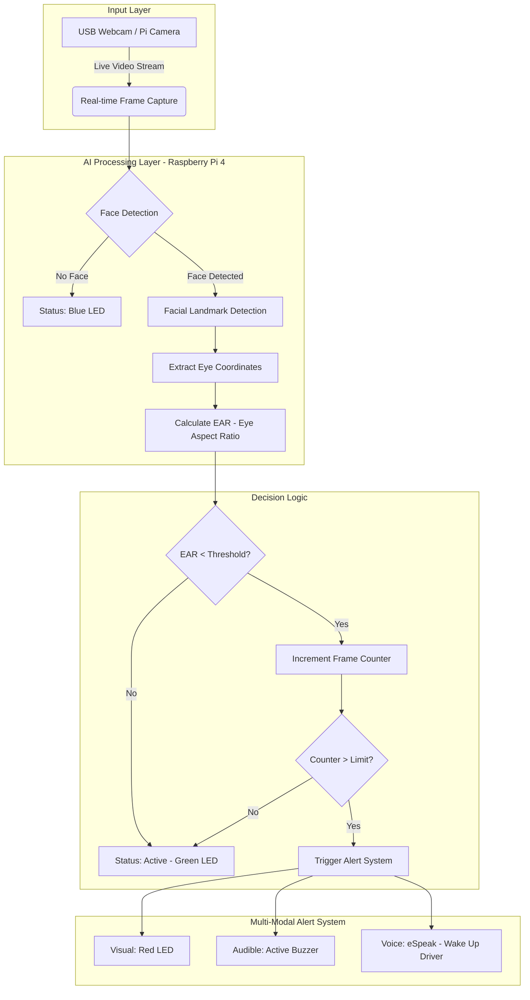

# IoT Driver Drowsiness Detection System


A real-time, non-intrusive driver monitoring system designed to enhance road safety by detecting early signs of fatigue or micro-sleep using computer vision and IoT integration.

---

## 1. Project Overview
The **IoT Driver Drowsiness Detection System** is an intelligent safety solution developed using a Raspberry Pi 4 and a USB camera. By analyzing live video streams, the system monitors the driver's eye movements and calculates the **Eye Aspect Ratio (EAR)**. If the system detects that the driver's eyes are closed for a prolonged period, it triggers a multi-stage alert system (Visual, Audible, and Voice) to wake the driver and prevent potential accidents.

## 2. Problem Statement
Road accidents caused by driver fatigue account for a significant percentage of traffic fatalities worldwide. Long driving hours, inadequate sleep, and the monotony of highways often result in drowsiness, leading to reduced reaction times and involuntary micro-sleeps. There is a critical need for an affordable, real-time, and reliable system to monitor driver alertness.

## 3. Objectives
*   **Enhance Road Safety:** Reduce accidents caused by driver fatigue by providing early warnings.
*   **Real-Time Monitoring:** Utilize computer vision for accurate, non-intrusive detection of eye closure.
*   **Affordable Solution:** Design a cost-effective system using off-the-shelf IoT components.
*   **Multi-Modal Alerts:** Ensure the driver is alerted through visual (LED), audible (Buzzer), and verbal (Voice) feedback.

## 4. Features
*   **Real-Time Face & Eye Tracking:** Uses dlib's 68 facial landmark model for precise eye localization.
*   **EAR-Based Logic:** Intelligent thresholding to distinguish between normal blinking and drowsiness.
*   **Multi-Stage Alert System:**
    *   **Green LED:** Driver is alert and active.
    *   **Blue LED:** No face detected (system is scanning).
    *   **Red LED + Buzzer + Voice:** Triggered when drowsiness is detected.
*   **Voice Alerts:** Uses `eSpeak` to announce "Wake up driver" through speakers.
*   **Auto-Cleanup:** Graceful shutdown of hardware components on exit.

## 5. Technologies Used
*   **Language:** Python 3
*   **Computer Vision:** OpenCV, Dlib
*   **Libraries:** `imutils`, `numpy`, `rpi_ws281x`
*   **Hardware Interface:** `RPi.GPIO`
*   **Audio Engine:** `espeak`, `aplay`

## 6. Hardware Components
| Component | Specification |
| :--- | :--- |
| **Raspberry Pi 4 Model B** | 4GB/8GB RAM (Main Controller) |
| **USB Webcam** | External HD camera for real-time video |
| **WS2813 RGB LED Stick** | 10 NeoPixel-compatible LEDs |
| **Active Buzzer Module** | 5V Buzzer for audible alarm |
| **USB/3.5mm Speaker** | For voice alerts |
| **MicroSD Card** | 16GB/32GB with Raspberry Pi OS |
| **Power Supply** | 5V 3A USB-C Adapter |
| **Jumper Wires** | Female-to-Female & Female-to-Male |

## 7. Software Requirements
Ensure the following are installed on your Raspberry Pi:
*   Python 3.7+
*   OpenCV (`opencv-python`)
*   Dlib
*   imutils
*   RPi.GPIO
*   rpi_ws281x
*   espeak & aplay (Linux audio utilities)

## 8. System Architecture
The system follows a standard **Input -> Processing -> Output** flow as illustrated in the diagram below:



### Workflow Details:
1.  **Input:** USB Webcam captures high-frequency video frames.
2.  **Processing:** Raspberry Pi 4 processes frames using OpenCV (Grayscale conversion) and Dlib (Landmark detection).
3.  **Analysis:** The system calculates the Eye Aspect Ratio (EAR) for both eyes.
4.  **Output:** Based on the EAR value, signals are sent to the Buzzer (GPIO 23), RGB LED (GPIO 21), and Speaker.

## 9. Working Principle
The system calculates the **Eye Aspect Ratio (EAR)** using the formula:
`EAR = (||p2 - p6|| + ||p3 - p5||) / (2 * ||p1 - p4||)`

### Detection Logic:
*   **EAR > 0.25:** Driver is **Active** (Green LED).
*   **0.21 < EAR <= 0.25:** Driver is showing signs of **Drowsiness**.
*   **EAR < 0.21 (for 10+ frames):** Driver is **Sleeping** (Red LED + Buzzer + Voice Alert).
*   **No Face Detected:** System indicates status with a **Blue LED**.

## 10. Folder Structure
The project is organized into the following structure to ensure modularity and ease of navigation:

| Folder / File | Description |
| :--- | :--- |
| **`code/`** | Root directory for all executable scripts and logic. |
| `code/drowsiness.py` | The main execution script for the monitoring system. |
| `code/shape_predictor_68_face_landmarks.dat` | Pre-trained dlib model for 68-point facial landmark detection. |
| `code/IOT Project.md` | Hardware configuration notes and wiring diagrams. |
| **`IOT_Project.pdf`** | Comprehensive academic project report and documentation. |
| **`.gitignore`** | Specifies files and folders to be ignored by Git (e.g., large models, caches). |
| **`README.md`** | Professional documentation providing a project overview and setup guide. |

## 11. Installation Steps
1.  **Clone the repository:**
    ```bash
    git clone https://github.com/your-username/iot-drowsiness-detection.git
    cd iot-drowsiness-detection/code
    ```
2.  **Install dependencies:**
    ```bash
    pip install opencv-python dlib imutils rpi-ws281x RPi.GPIO
    sudo apt-get install espeak aplay
    ```
3.  **Download Dlib Model:**
    Ensure `shape_predictor_68_face_landmarks.dat` is present in the `code/` folder.

## 12. How to Run
1.  Connect the hardware components (Buzzer to GPIO 23, LED to GPIO 21).
2.  Run the main script:
    ```bash
    python drowsiness.py
    ```
3.  Press `q` to exit the monitor and safely shut down the hardware.

## 13. Applications
*   **Commercial Transport:** Long-haul trucking and bus services.
*   **Personal Safety:** Night driving assistance for private car owners.
*   **Fleet Management:** Real-time monitoring of delivery personnel.
*   **Industrial Safety:** Monitoring operators of heavy machinery.

## 14. Future Enhancements
*   **Night Vision:** Integration of IR/NoIR cameras for low-light detection.
*   **Cloud Logging:** Syncing fatigue data to a dashboard for fleet managers.
*   **Mobile App:** Sending push notifications to emergency contacts.
*   **Advanced AI:** Using Deep Learning (CNN/LSTM) for even higher accuracy.

## 15. License
This project is licensed under the **MIT License**.

---
**Developed by:**
*   Abhilash Pyati (2SD23CS002)
*   Karan Kumbar (2SD23CS041)
*   Naveen Gurikar (2SD23CS061)
*   Samarth Sanikop (2SD23CS086)

**Department of Computer Science and Engineering**
**SDM College of Engineering and Technology, Dharwad**
